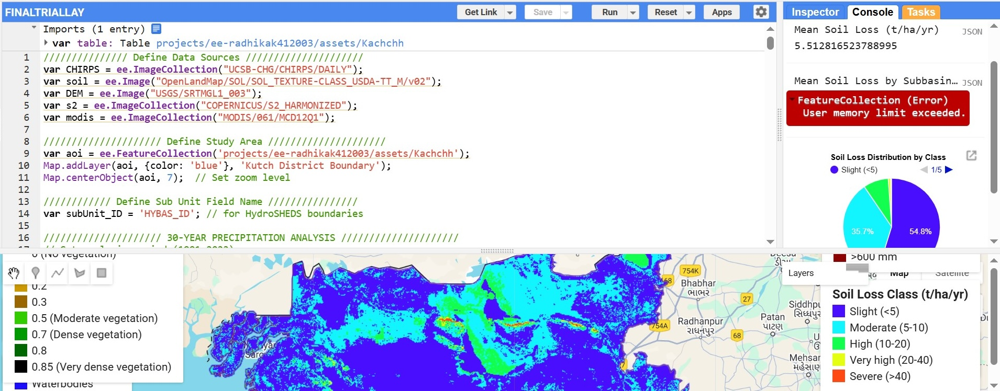
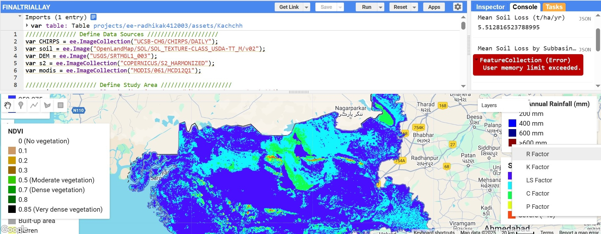
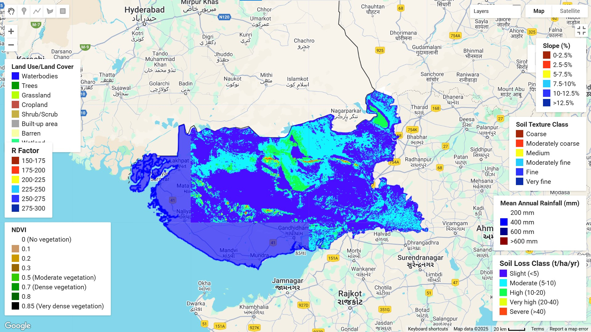
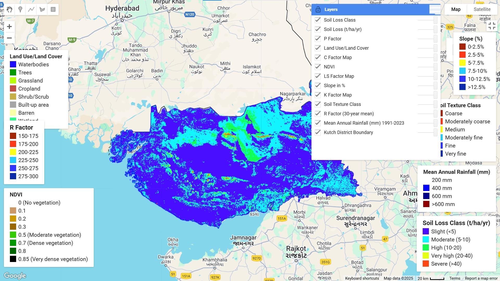

# RUSLE Model for Soil Erosion Assessment in Kachchh District

This repository contains a Google Earth Engine (GEE) implementation of the Revised Universal Soil Loss Equation (RUSLE) to assess soil erosion rates in the Kachchh District of Gujarat, India.

## Overview

Soil erosion is a significant environmental threat to land resources worldwide. This project applies the RUSLE model to quantify soil erosion rates and identify areas vulnerable to erosion in the arid to semi-arid landscape of Kachchh. The model combines long-term rainfall data with soil properties, topography, and land cover characteristics to estimate annual soil loss.

## The RUSLE Model

The Revised Universal Soil Loss Equation calculates annual soil loss using the following formula:

**A = R × K × LS × C × P**

Where:
- **A**: Annual soil loss (tons/ha/year)
- **R**: Rainfall erosivity factor (MJ·mm/ha·h·yr)
- **K**: Soil erodibility factor (t·ha·h/ha·MJ·mm)
- **LS**: Slope length and steepness factor (dimensionless)
- **C**: Cover management factor (dimensionless)
- **P**: Support practice factor (dimensionless)

## Features

- Calculates 30-year precipitation analysis (1991-2023) using CHIRPS data
- Maps soil erodibility based on soil texture classes from OpenLandMap
- Generates topographic factor (LS) using SRTM digital elevation data
- Derives vegetation cover factor from Sentinel-2 NDVI
- Assigns support practice factors based on land use/cover from MODIS
- Provides comprehensive statistics on soil erosion severity
- Includes multiple visualization options with interactive legends

## Prerequisites

To run this code, you need:

1. A Google Earth Engine account
2. Access to the following Earth Engine datasets:
   - CHIRPS daily precipitation data
   - OpenLandMap soil texture data
   - SRTM digital elevation model
   - Sentinel-2 harmonized surface reflectance
   - MODIS land cover

## Required Assets

The code requires one custom asset:
- A feature collection named 'Kachchh' defining the boundaries of Kachchh district

You can import this as a shapefile to your GEE assets and update the asset ID in the code:
```javascript
var aoi = ee.FeatureCollection('projects/your-project-id/assets/Kachchh');
```

## Usage

1. Copy the code to your Google Earth Engine Code Editor
2. Update the asset path for the Kachchh district boundary
3. Run the script to generate soil erosion maps and statistics
4. Export the results to Google Drive using the export tools provided in the code

## Images

### CODE SNIPIT


### Factor Layer


### Rusle Model


### Rusle Layer


## Configuration

You can modify the following parameters in the code:

- **Study period**: Change `startYear` and `endYear` variables to analyze different time periods
- **Date range for land cover**: Adjust `date1` and `date2` to use different years for LULC analysis
- **Classification thresholds**: Modify the expressions in `SL_class` to adjust soil loss severity classes
- **Export settings**: Update the export parameters to save results to your preferred location

## Working

[More details click](DOCUMENT.md)

## Results

The code produces the following outputs:

1. **Maps**:
   - Mean annual rainfall
   - RUSLE factors (R, K, LS, C, P)
   - Soil loss (t/ha/yr)
   - Soil loss classified by severity

2. **Statistics**:
   - Mean soil loss for the entire region
   - Mean soil loss by subbasin
   - Distribution of soil loss classes (area)
   - Detailed class statistics exportable to CSV

3. **Visualizations**:
   - Interactive legends for all maps
   - Chart showing soil loss class distribution

## Understanding Soil Loss Classes

The soil loss is classified into five severity classes:

| Class | Severity | Soil Loss (t/ha/yr) |
|-------|----------|---------------------|
| 1     | Slight   | < 5                 |
| 2     | Moderate | 5-10                |
| 3     | High     | 10-20               |
| 4     | Very high| 20-40               |
| 5     | Severe   | > 40                |

## Export Options

The code includes functionality to export:
- Class-wise soil loss areas by subbasin (CSV format)
- You can add code to export maps as GeoTIFF by uncommenting export lines

## Citing This Work

If you use this code in your research, please cite as:
```
Radhika Kanojiya. (2025). RUSLE Model for Soil Erosion Assessment in Kachchh District. GitHub Repository.
```

## License

This project is licensed under the MIT License - see the LICENSE file for details.

## Acknowledgments

- CHIRPS for precipitation data
- OpenLandMap for soil data
- USGS for SRTM elevation data
- ESA for Sentinel-2 imagery
- NASA for MODIS land cover products
- Google Earth Engine team for the platform

## Contact

For questions or feedback, please create an issue in this repository.
